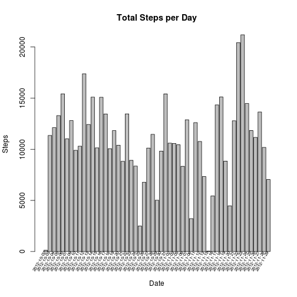
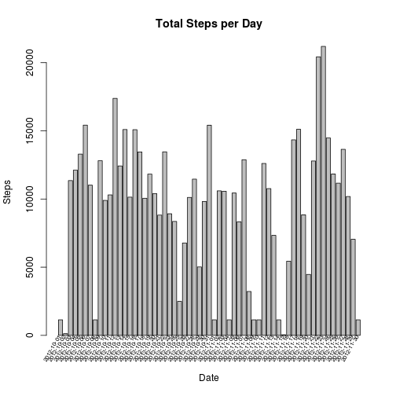

# Load the cell phone data and create a filtered dataset without any NA values.


```r
raw_data <- read.csv(file="activity.csv", header=TRUE, sep=",");
filtered_data <- raw_data[complete.cases(raw_data),];
```

Below is a summary of the filtered data:


```
##      steps                date          interval     
##  Min.   :  0.00   2012-10-02:  288   Min.   :   0.0  
##  1st Qu.:  0.00   2012-10-03:  288   1st Qu.: 588.8  
##  Median :  0.00   2012-10-04:  288   Median :1177.5  
##  Mean   : 37.38   2012-10-05:  288   Mean   :1177.5  
##  3rd Qu.: 12.00   2012-10-06:  288   3rd Qu.:1766.2  
##  Max.   :806.00   2012-10-07:  288   Max.   :2355.0  
##                   (Other)   :13536
```

# What is mean total number of steps taken per day?

### Create a histogram of the total number of steps per day.


```r
alt <- split(filtered_data, filtered_data$date, drop = TRUE);
ylabels <- as.vector(as.character(attributes(alt)$names));
x<-barplot(sapply(1:length(alt),function(x) sum(alt[[x]]$steps)), 
           main="Total Steps per Day", xlab="Date", ylab="Steps");
text(x=x-0.25, y=-1.5, adj=1, xpd = TRUE, ylabels, srt=60, cex=0.65);
```

 

### Calculate and report the mean and median steps per day.


```r
day <- attributes(alt)$names;
mean_steps <- sapply(1:length(alt),function(x) mean(alt[[x]]$steps));
median_steps <- sapply(1:length(alt),function(x) median(alt[[x]]$steps));
raw_mean_steps_data <- data.frame(day,mean_steps,median_steps);
```


```
##           day mean_steps median_steps
## 1  2012-10-02  0.4375000            0
## 2  2012-10-03 39.4166667            0
## 3  2012-10-04 42.0694444            0
## 4  2012-10-05 46.1597222            0
## 5  2012-10-06 53.5416667            0
## 6  2012-10-07 38.2465278            0
## 7  2012-10-09 44.4826389            0
## 8  2012-10-10 34.3750000            0
## 9  2012-10-11 35.7777778            0
## 10 2012-10-12 60.3541667            0
## 11 2012-10-13 43.1458333            0
## 12 2012-10-14 52.4236111            0
## 13 2012-10-15 35.2048611            0
## 14 2012-10-16 52.3750000            0
## 15 2012-10-17 46.7083333            0
## 16 2012-10-18 34.9166667            0
## 17 2012-10-19 41.0729167            0
## 18 2012-10-20 36.0937500            0
## 19 2012-10-21 30.6284722            0
## 20 2012-10-22 46.7361111            0
## 21 2012-10-23 30.9652778            0
## 22 2012-10-24 29.0104167            0
## 23 2012-10-25  8.6527778            0
## 24 2012-10-26 23.5347222            0
## 25 2012-10-27 35.1354167            0
## 26 2012-10-28 39.7847222            0
## 27 2012-10-29 17.4236111            0
## 28 2012-10-30 34.0937500            0
## 29 2012-10-31 53.5208333            0
## 30 2012-11-02 36.8055556            0
## 31 2012-11-03 36.7048611            0
## 32 2012-11-05 36.2465278            0
## 33 2012-11-06 28.9375000            0
## 34 2012-11-07 44.7326389            0
## 35 2012-11-08 11.1770833            0
## 36 2012-11-11 43.7777778            0
## 37 2012-11-12 37.3784722            0
## 38 2012-11-13 25.4722222            0
## 39 2012-11-15  0.1423611            0
## 40 2012-11-16 18.8923611            0
## 41 2012-11-17 49.7881944            0
## 42 2012-11-18 52.4652778            0
## 43 2012-11-19 30.6979167            0
## 44 2012-11-20 15.5277778            0
## 45 2012-11-21 44.3993056            0
## 46 2012-11-22 70.9270833            0
## 47 2012-11-23 73.5902778            0
## 48 2012-11-24 50.2708333            0
## 49 2012-11-25 41.0902778            0
## 50 2012-11-26 38.7569444            0
## 51 2012-11-27 47.3819444            0
## 52 2012-11-28 35.3576389            0
## 53 2012-11-29 24.4687500            0
```

# What is the average daily activity pattern?

### Make a time series plot of the 5-minute interval and the average number of steps taken.


```r
alt <- split(filtered_data, filtered_data$interval, drop = TRUE);
plot(attributes(alt)$names, sapply(1:length(alt),function(x) mean(alt[[x]]$steps)), 
     type="l", main="Mean Steps per Interval", xlab="Interval", ylab="Steps");
```

 

### Which 5-minute interval, on average across all the days in the dataset, contains the maximum number of steps?


```r
max_avg_interval <- alt[[which.max(sapply(1:length(alt),function(x) mean(alt[[x]]$steps)))]]$interval[1];
```


```
## [1] 835
```

# Imputing missing values

### Calculate and report the total number of missing values in the dataset


```r
num_nas = dim(raw_data)[1]-dim(filtered_data)[1];
```


```
## [1] 2304
```

### Create a new dataset that is equal to the original dataset but with the missing data filled in.

Below, the missing values will be set to the median of all existing values which share
the same interval size.


```r
new_data = raw_data;
alt <- split(filtered_data, filtered_data$interval, drop = TRUE);
steps_per_interval <- sapply(1:length(alt),function(x) median(alt[[x]]$steps));
for ( i in which(is.na(new_data[,1])))
{
    new_data[i,1] = steps_per_interval[which(new_data[i,3] == attributes(alt)$names)];
}
```

Below is a summary of the data with imputed missing values:


```
##      steps             date          interval     
##  Min.   :  0   2012-10-01:  288   Min.   :   0.0  
##  1st Qu.:  0   2012-10-02:  288   1st Qu.: 588.8  
##  Median :  0   2012-10-03:  288   Median :1177.5  
##  Mean   : 33   2012-10-04:  288   Mean   :1177.5  
##  3rd Qu.:  8   2012-10-05:  288   3rd Qu.:1766.2  
##  Max.   :806   2012-10-06:  288   Max.   :2355.0  
##                (Other)   :15840
```


### Make a histogram of the total number of steps taken each day.


```r
alt <- split(new_data, new_data$date, drop = TRUE);
x<-barplot(sapply(1:length(alt),function(x) sum(alt[[x]]$steps)), 
           main="Total Steps per Day", xlab="Date", ylab="Steps");
ylabels <- as.vector(as.character(attributes(alt)$names));
text(x=x-0.25, y=-1.5, adj=1, xpd = TRUE, ylabels, srt=60, cex=0.65);
```

 

### Calculate and report the mean and median total number of steps taken per day.


```r
day <- attributes(alt)$names;
mean_steps <- sapply(1:length(alt),function(x) mean(alt[[x]]$steps));
median_steps <- sapply(1:length(alt),function(x) median(alt[[x]]$steps));
imputed_mean_steps_data <- data.frame(day,mean_steps,median_steps);
```
                                              

```
##           day mean_steps median_steps
## 1  2012-10-01  3.9618056            0
## 2  2012-10-02  0.4375000            0
## 3  2012-10-03 39.4166667            0
## 4  2012-10-04 42.0694444            0
## 5  2012-10-05 46.1597222            0
## 6  2012-10-06 53.5416667            0
## 7  2012-10-07 38.2465278            0
## 8  2012-10-08  3.9618056            0
## 9  2012-10-09 44.4826389            0
## 10 2012-10-10 34.3750000            0
## 11 2012-10-11 35.7777778            0
## 12 2012-10-12 60.3541667            0
## 13 2012-10-13 43.1458333            0
## 14 2012-10-14 52.4236111            0
## 15 2012-10-15 35.2048611            0
## 16 2012-10-16 52.3750000            0
## 17 2012-10-17 46.7083333            0
## 18 2012-10-18 34.9166667            0
## 19 2012-10-19 41.0729167            0
## 20 2012-10-20 36.0937500            0
## 21 2012-10-21 30.6284722            0
## 22 2012-10-22 46.7361111            0
## 23 2012-10-23 30.9652778            0
## 24 2012-10-24 29.0104167            0
## 25 2012-10-25  8.6527778            0
## 26 2012-10-26 23.5347222            0
## 27 2012-10-27 35.1354167            0
## 28 2012-10-28 39.7847222            0
## 29 2012-10-29 17.4236111            0
## 30 2012-10-30 34.0937500            0
## 31 2012-10-31 53.5208333            0
## 32 2012-11-01  3.9618056            0
## 33 2012-11-02 36.8055556            0
## 34 2012-11-03 36.7048611            0
## 35 2012-11-04  3.9618056            0
## 36 2012-11-05 36.2465278            0
## 37 2012-11-06 28.9375000            0
## 38 2012-11-07 44.7326389            0
## 39 2012-11-08 11.1770833            0
## 40 2012-11-09  3.9618056            0
## 41 2012-11-10  3.9618056            0
## 42 2012-11-11 43.7777778            0
## 43 2012-11-12 37.3784722            0
## 44 2012-11-13 25.4722222            0
## 45 2012-11-14  3.9618056            0
## 46 2012-11-15  0.1423611            0
## 47 2012-11-16 18.8923611            0
## 48 2012-11-17 49.7881944            0
## 49 2012-11-18 52.4652778            0
## 50 2012-11-19 30.6979167            0
## 51 2012-11-20 15.5277778            0
## 52 2012-11-21 44.3993056            0
## 53 2012-11-22 70.9270833            0
## 54 2012-11-23 73.5902778            0
## 55 2012-11-24 50.2708333            0
## 56 2012-11-25 41.0902778            0
## 57 2012-11-26 38.7569444            0
## 58 2012-11-27 47.3819444            0
## 59 2012-11-28 35.3576389            0
## 60 2012-11-29 24.4687500            0
## 61 2012-11-30  3.9618056            0
```

### Do these values differ from the estimates from the first part of the assignment?

The mean and median estimates from the imputed data differ from the estimates
computed in the section above where missing values were omitted, as shown in
the table below:


```r
day <- attributes(alt)$names;
delta_mean_steps <- sapply(1:length(alt),function(x) raw_mean_steps_data[x,2] - 
                               imputed_mean_steps_data[x,2]);
delta_median_steps <- sapply(1:length(alt),function(x) raw_mean_steps_data[x,3] - imputed_mean_steps_data[x,3]);
delta_data <- data.frame(day,delta_mean_steps,delta_median_steps);
```


```
##           day delta_mean_steps delta_median_steps
## 1  2012-10-01      -3.52430556                  0
## 2  2012-10-02      38.97916667                  0
## 3  2012-10-03       2.65277778                  0
## 4  2012-10-04       4.09027778                  0
## 5  2012-10-05       7.38194444                  0
## 6  2012-10-06     -15.29513889                  0
## 7  2012-10-07       6.23611111                  0
## 8  2012-10-08      30.41319444                  0
## 9  2012-10-09      -8.70486111                  0
## 10 2012-10-10      25.97916667                  0
## 11 2012-10-11       7.36805556                  0
## 12 2012-10-12      -7.93055556                  0
## 13 2012-10-13      -7.94097222                  0
## 14 2012-10-14      -0.04861111                  0
## 15 2012-10-15      11.50347222                  0
## 16 2012-10-16     -17.45833333                  0
## 17 2012-10-17      -5.63541667                  0
## 18 2012-10-18       1.17708333                  0
## 19 2012-10-19     -10.44444444                  0
## 20 2012-10-20      10.64236111                  0
## 21 2012-10-21       0.33680556                  0
## 22 2012-10-22     -17.72569444                  0
## 23 2012-10-23     -22.31250000                  0
## 24 2012-10-24      -5.47569444                  0
## 25 2012-10-25      26.48263889                  0
## 26 2012-10-26      16.25000000                  0
## 27 2012-10-27     -17.71180556                  0
## 28 2012-10-28      -5.69097222                  0
## 29 2012-10-29      36.09722222                  0
## 30 2012-10-30       2.71180556                  0
## 31 2012-10-31     -16.81597222                  0
## 32 2012-11-01      32.28472222                  0
## 33 2012-11-02      -7.86805556                  0
## 34 2012-11-03       8.02777778                  0
## 35 2012-11-04       7.21527778                  0
## 36 2012-11-05       7.53125000                  0
## 37 2012-11-06       8.44097222                  0
## 38 2012-11-07     -19.26041667                  0
## 39 2012-11-08     -11.03472222                  0
## 40 2012-11-09      14.93055556                  0
## 41 2012-11-10      45.82638889                  0
## 42 2012-11-11       8.68750000                  0
## 43 2012-11-12      -6.68055556                  0
## 44 2012-11-13      -9.94444444                  0
## 45 2012-11-14      40.43750000                  0
## 46 2012-11-15      70.78472222                  0
## 47 2012-11-16      54.69791667                  0
## 48 2012-11-17       0.48263889                  0
## 49 2012-11-18     -11.37500000                  0
## 50 2012-11-19       8.05902778                  0
## 51 2012-11-20      31.85416667                  0
## 52 2012-11-21      -9.04166667                  0
## 53 2012-11-22     -46.45833333                  0
## 54 2012-11-23               NA                 NA
## 55 2012-11-24               NA                 NA
## 56 2012-11-25               NA                 NA
## 57 2012-11-26               NA                 NA
## 58 2012-11-27               NA                 NA
## 59 2012-11-28               NA                 NA
## 60 2012-11-29               NA                 NA
## 61 2012-11-30               NA                 NA
```

### What is the impact of imputing missing data on the estimates of the total daily number of steps?

As shown in the table above, imputing missing values using the method chosen above
results in a biased mean estimate and an unbiased median estimate.

# Are there differences in activity patterns between weekdays and weekends?

### Create a new factor variable in the dataset with two levels indicating whether a given date is a weekday or weekend day.


```r
day <- new_data$date;
weekday_info <- weekdays(as.Date(day));
weekday_info <- gsub("Monday|Tuesday|Wednesday|Thursday|Friday", "weekday", weekday_info);
weekday_info <- gsub("Saturday|Sunday", "weekend", weekday_info);
weekday_info <- as.factor(weekday_info);
```

Below is a sample of the data with imputed missing values:


```
##  [1] weekday weekday weekday weekday weekday weekday weekday weekday
##  [9] weekday weekday weekday weekday weekday weekday weekday weekday
## [17] weekday weekday weekday weekday weekday weekday weekday weekday
## [25] weekday weekday weekday weekday weekday weekday weekday weekday
## [33] weekday weekday weekday weekday weekday weekday weekday weekday
## [41] weekday weekday weekday weekday weekday weekday weekday weekday
## [49] weekday weekday weekday weekday weekday weekday weekday weekday
## [57] weekday weekday weekday weekday weekday weekday weekday weekday
## [65] weekday weekday weekday weekday weekday weekday weekday weekday
## [73] weekday weekday weekday weekday weekday weekday weekday weekday
## Levels: weekday weekend
```

Below is a summary of the data with imputed missing values:


```
## weekday weekend 
##   12960    4608
```


### Make a panel plot containing a time series plot of the 5 minute interval and the average number of steps taken, averaged across all weekday days or weekend days.


```r
weekday_data <- new_data[which(weekday_info=="weekday"), ]
weekend_data <- new_data[which(weekday_info=="weekend"), ]

par(mfrow=c(2,1), mar=c(4,4,2,0));
alt <- split(weekday_data, weekday_data$interval, drop = TRUE);
plot(attributes(alt)$names, sapply(1:length(alt),function(x) mean(alt[[x]]$steps)), 
     type="l", main="Mean Steps per Interval (Weekday)", xlab="Interval", ylab="Steps");

alt <- split(weekend_data, weekend_data$interval, drop = TRUE);
plot(attributes(alt)$names, sapply(1:length(alt),function(x) mean(alt[[x]]$steps)), 
     type="l", main="Mean Steps per Interval (Weekend)", xlab="Interval", ylab="Steps");
```

 
